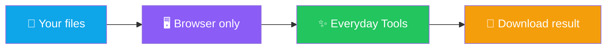

<p align="center">
  
</p>

<h1 align="center">@manansbdb</h1>

<p align="center">
  <strong>EN</strong> Building free tools people can use in the browser — privacy-first<br/>
  <strong>PT</strong> A construir ferramentas grátis no browser — privacidade em primeiro
</p>

<p align="center">
  <a href="https://manansbdb.github.io/everyday-tools/"></a>
  
  
</p>

---

## Flagship / Produto principal

### [Everyday Tools](https://github.com/manansbdb/everyday-tools)

Free browser utilities: compress/convert images, merge/split PDFs, QR codes, text cleanup, money calculators. **Everything runs on your device** — no uploads, no ads, no signup.

Ferramentas grátis no browser: imagens, PDFs, QR, texto, calculadoras. **Tudo no teu dispositivo** — sem uploads, sem anúncios, sem conta.

| | |
|--|--|
| **Live demo** | https://manansbdb.github.io/everyday-tools/ |
| **Source** | https://github.com/manansbdb/everyday-tools |
| **Cost** | Free / Grátis |



---

## Other kits / Outros kits

Useful templates and checklists (MIT, EN+PT). Full list: [repositories](https://github.com/manansbdb?tab=repositories).

| Repo | What / O quê |
|------|----------------|
| [engenharia-kit](https://github.com/manansbdb/engenharia-kit) | PR/issue templates + checklists |
| [cyberchef-recipes](https://github.com/manansbdb/cyberchef-recipes) | CyberChef recipes |
| [github-actions-templates](https://github.com/manansbdb/github-actions-templates) | CI workflows |

---

## Support / Apoio

Optional — never required to use the tools.

### GitHub Sponsors
When enabled on this account: [github.com/sponsors/manansbdb](https://github.com/sponsors/manansbdb) (setup is free; GitHub may ask for your payout details).

### Bitcoin (optional)

```
bc1q0qfnlnxyum9u45stzxe0a7jnhtj4j0usfkqdjw
```

Donations do not promise anonymity or tax advice.

---

<p align="center"><i>Build in public · MIT · free forever for core tools · EN + PT</i></p>
