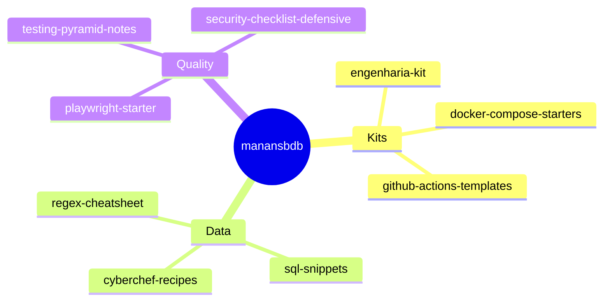

<p align="center">
  
</p>

<h1 align="center">@manansbdb</h1>

<p align="center">
  <strong>EN</strong> Engineering · open source · practical day-to-day tools<br/>
  <strong>PT</strong> Engenharia · open source · ferramentas práticas para o dia a dia
</p>

<p align="center">
  
  
  
  <a href="#support--apoio"></a>
</p>

---

## What you'll find here / O que encontras aqui

Kits, starters and cheatsheets you can **clone and use immediately** — CI, Docker, API design, testing, security checklists, and more.

Kits, starters e cheatsheets para **clonar e usar já** — CI, Docker, APIs, testes, checklists de segurança, e mais.



---

## Featured / Destaques

| Repo | What it is / O que é | Install |
|------|----------------------|---------|
| [cyberchef-recipes](https://github.com/manansbdb/cyberchef-recipes) | Importable CyberChef recipes | `git clone` + Load recipe |
| [engenharia-kit](https://github.com/manansbdb/engenharia-kit) | PR/issue/checklist kit | Copy `.github/` into your repo |
| [github-actions-templates](https://github.com/manansbdb/github-actions-templates) | CI workflow templates | Copy workflows |
| [docker-compose-starters](https://github.com/manansbdb/docker-compose-starters) | Compose stacks | `docker compose up` |
| [security-checklist-defensive](https://github.com/manansbdb/security-checklist-defensive) | Defensive security checklist | Read / adapt |
| [typescript-tsconfig-presets](https://github.com/manansbdb/typescript-tsconfig-presets) | Strict tsconfig bases | Extend in `tsconfig.json` |

📂 Full list: [repositories](https://github.com/manansbdb?tab=repositories)

---

## How to use any kit / Como usar qualquer kit

```bash
git clone https://github.com/manansbdb/<repo-name>.git
cd <repo-name>
# follow the Install section in that README
```

Every repo includes: bilingual docs, MIT license, and a Support section.

Cada repo inclui: docs bilingues, licença MIT e secção de Apoio.

---

## Support / Apoio

### English
If a project helps you, support with Bitcoin:

```
bc1q0qfnlnxyum9u45stzxe0a7jnhtj4j0usfkqdjw
```

**Network:** BTC (Bech32).

### Português
Se algum projeto te ajudar, apoia com Bitcoin:

```
bc1q0qfnlnxyum9u45stzxe0a7jnhtj4j0usfkqdjw
```

**Rede:** BTC (Bech32).

---

<p align="center"><i>Build in public · MIT · no paywall · EN + PT</i></p>
